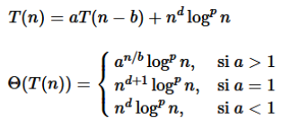
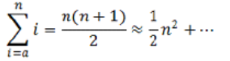

# 📘 Análisis de la Complejidad y Eficiencia de Algoritmos

**Asignatura:** Estructuras de Datos y Algoritmos  
**Curso:** 2025-2026  
**Autor:** Rodrigo Arambarri Osuna 

---

## 🧭 Contenido

1. [Introducción](#introducción)
2. [Análisis de la complejidad](#análisis-de-la-complejidad)
3. [Complejidad de sumatorios](#complejidad-de-sumatorios)
4. [Complejidad de recurrencias](#complejidad-de-recurrencias)
5. [Relación entre sumatorios y recurrencias](#relación-sumatorios-y-recurrencias)
6. [Ejemplos prácticos](#ejemplos-prácticos)
7. [Caso mejor, peor y medio](#caso-mejor-peor-y-medio)

---

## 🧩 Introducción

A la hora de **elegir un algoritmo**, se busca que:

- Sea **fácil de entender, codificar, depurar y mantener.**
- Use **eficientemente los recursos** (tiempo, memoria).
- Se ejecute en el **menor tiempo posible.**

Estos objetivos son a menudo **contrapuestos**, teniendo que sacrificar uno para obtener otro, por lo que es esencial **analizar su complejidad**.

---

### 🔹 ¿Qué es el análisis de complejidad?

Es el **estudio del tiempo de ejecución** de un algoritmo en función del **tamaño del problema** (`n`).

Se representa con una **función T(n)**, generalmente **monótona creciente**, que buscaremos asemejar a su **clase de equivalencia** correspondiente.

Queremos saber:
> ¿Cómo se comporta T(n) cuando n crece mucho?

---

### 🔹 Jerarquía de órdenes de complejidad

| Orden | Nombre | Ejemplo típico |
|:------|:--------|:----------------|
| O(1) | Constante | Acceso a un elemento de un array |
| O(log n) | Logarítmico | Búsqueda binaria |
| O(n) | Lineal | Recorrido de una lista |
| O(n log n) | Cuasi-lineal | MergeSort, QuickSort promedio |
| O(n²) | Cuadrático | BubbleSort |
| O(n³) | Cúbico | Multiplicación de matrices |
| O(aⁿ) | Exponencial | Backtracking, fuerza bruta |
| O(n!) | Factorial | Generar todas las permutaciones |


---

### 🔹 Ejemplo comparativo: efecto de duplicar el tamaño del problema

| T(n) | n = 100 | n = 200 |
|:------|:----------|:----------|
| $k_{1} \thinspace log \thinspace n$ | 1 s | 1.15 s |
| $k_{2} \thinspace n$ | 1 s | 2 s |
| $k_{3} \thinspace n \thinspace log \thinspace n$ | 1 s | 2.3 s |
| $k_{4} \thinspace n^{2}$ | 1 s | 4 s |
| $k_{5} \thinspace n^{3}$ | 1 s | 8 s |
| $k_{6} \thinspace 2^{n}$ | 1 s | 1.27×10³⁰ s |

---

### 🔹 Ejemplo comparativo: efecto de duplicar el tiempo disponible

| T(n) | t = 1 s | t = 2 s |
|:------|:----------|:----------|
| $k_{1} \thinspace log \thinspace n$ | n=100 | n=10000 |
| $k_{2} \thinspace n$ | n=100 | n=200 |
| $k_{3} \thinspace n \thinspace log \thinspace n$ | n=100 | n=178 |
| $k_{4} \thinspace n^{2}$ | n=100 | n=141 |
| $k_{5} \thinspace n^{3}$ | n=100 | n=126 |
| $k_{6} \thinspace 2^{n}$ | n=100 | n=101 |

---

## ⚙️ Análisis de la complejidad

### 🔹 Tamaño del problema (n)

Es la **cantidad de información necesaria** para representarlo, definido a partir de las propiedades del mismo.  
Cada subproblema debe ser **más pequeño que el original**.

Ejemplo:

```java
boolean contieneMultiplo(List<Integer> lista, int a) {
    boolean res = false;
    for (int e : lista) {
        res = e%a == 0
        if(res) break;
    }
    return res;
}
```

---

### 🔹 Complejidades if/while/for

#### Secuencia de bloques

```c
s1;
s2;
...
sk;
```
**Complejidad total:**  
```math
T_s(n) = T_{s1}(n) + T_{s2}(n) + ... + T_{sk}(n)
```

#### Bloque condicional (if)

```c
if (g) {
    s1;
} else {
    s2;
}
```

**Complejidad:**  
```math
T_{if}^p=T_g^p+\max \left(T_{s1}^p, T_{s2}^p\right)
```
```math
T_{if}^m=T_g^m+\min \left(T_{s1}^m, T_{s2}^m\right)
```
```math
T_{if}^{md}=T_g^{md}+\max \left(T_{s1}^{md}, T_{s2}^{md}\right)
```  
(siendo $f_i$ la frecuencia de ejecución del bloque $si/i\in[1,2]$)

#### Bloque iterativo (while/for)

```c
while (g) {
    s;
}
```

**Complejidad:**  
```math
T_w(n)=T_g+\sum_{i \in I}\left(T_g+T_s(i)\right)
```
(siendo $I$ el conjunto de valores que va tomando el tamaño en las sucesivas iteraciones)

---

## ❓ Complejidad de la recursión
### 🔹 Complejidad de un algoritmo recursivo sin memoria  
La **ecuación de recurrencias** para estimar el **tiempo total** para resolver el problema de tamaño $n$ **dependerá** de la complejidad (tiempo) de todas las **llamadas recursivas** y de la complejidad (tiempo) del **cuerpo del algoritmo**.  
```math
T(n)=T\left(t_0(n)\right)+T\left(t_1(n)\right)+\ldots+T\left(t_{k-1}(n)\right)+f(n)
```

### 🔹 Complejidad de un algoritmo recursivo con memoria 
Como cada subproblema se resuelve **una sola vez**, la **ecuación de recurrencias** dependerá del **número de subproblemas** distintos necesarios para resolver el problema y la **complejidad** de los mismos.  
```math
\Theta\left(\sum_{p \in \mathcal{P}} f\left(n_p\right)\right)
```

---

## 🧮 Complejidad de sumatorios

Los **bucles** suelen expresarse como **sumatorios**, y su complejidad depende del tipo de progresión:

- **Progresión aritmética (PA):**  
    La variable de control se incrementa en una cantidad fija.  
    Ejemplo: `for (i = 0; i < n; i++)`  
```math
\sum_{x \in p a(a, r)}^n x^d \log ^p x=_{\infty} \frac{1}{r(d+1)} n^{d+1} \log ^p n  
```
    $pa(a,r)$ es progresión aritmética ($x$ recorre la secuencia $a+ri, i=0,1,2,...$ hasta $x=n$)

- **Progresión geométrica (PG):**  
    La variable se multiplica por una razón constante.  
    Ejemplo: `for (i = 1; i < n; i *= 2)`  
```math
\sum_{x\in pg(a,r)}^n x^d\log^px\cong_{\infty} \begin{cases}\log^{p+1} n,&\text{ si }d=0,r>1\\n^d\log^pn,&\text{ si }d>0,r>1\end{cases}  
```
    $pg(a,r)$ es progresión geom'etrica ($x$ recorre la secuencia $ar^i, i=0,1,2,...$ hasta $x=n$)

### Propiedades útiles

1. Linealidad del sumatorio:  
    ```math
    \sum_{i=a}^b(f(i)+g(i))=\sum_{i=a}^b f(i)+\sum_{i=a}^b g(i)
    ```

2. Producto de sumas:  
    ```math
    \sum_{i=a}^b \sum_{j=c}^d f(i) g(j)=\sum_{i=a}^b f(i) \sum_{j=c}^d g(j)
    ```

3. Extracción de constantes:
    ```math
    \sum_{i=a}^b(g(x) f(i))=g(x) \sum_{i=a}^b f(i), \text{si } g(x) \text{ no depende de }i
    ```

---

## 🔁 Complejidad de recurrencias

### 🔹 Concepto

Un **algoritmo recursivo** se categoriza según el tamaño de los **subproblemas** respecto al problema ($n-b$ o $n/b$).

**Ejemlpo de ecuación de recurrencia no lineal:**  
```math
T(n) = a \cdot T(n-n) + g(n)
```

**Ejemlpo de ecuación de recurrencia no lineal:**  
```math
T(n) = a \cdot T(n/b) + g(n)
```

- `a`: número de subproblemas
- `b`: factor de reducción del tamaño
- `g(n)`: coste fuera de las llamadas recursivas

---

### 🔹 Recurencias lineales

```math
T(n)=a \cdot T(n-b)+n^d \log ^p n
```
```math
\Theta(T(n))= \begin{cases}a^{n / b} \log ^p n, & \text { si } a>1 \\ n^{d+1} \log ^p n, & \text { si } a=1 \\ n^d \log ^p n, & \text { si } a<{1}\end{cases}
```

**Recurencias lineales (aproximaciones)**  
```math
T(n)=a_1\cdot T(n-b_1)+a_2\cdot T(n-b_2)+...+a-k\cdot T(n-b_k)+g(n), b_i < b_{i+1}
```

**Verifica**  
```math
\Theta(R(n))<\Theta(T(n))<\Theta(S(n))
```

**Donde:** 
```math 
R(n)=(a_1+a_2+...+a_k)\cdot R(n-b_k)+g(n) 
```
```math
S(n)=(a_1+a_2+...+a_k)\cdot S(n-b_1)+g(n)
```

---

### 🔹 Recurencias no lineales

```math
T(n)=a \cdot T(n/b)+n^d \log ^p n
```
```math
\Theta(T(n))= \begin{cases} n^{\log_ba}, & \text{si }a>b^d \\ n^d\log^{p+1}n, & \text{si }a=b^d \\ n^d\log^pn, & \text{si }a<{b^d} \end{cases}
```

**Recurencias no lineales (aproximaciones)**  
```math
T(n)=a_1 T\left(\frac{n}{b_1}\right)+a_2 T\left(\frac{n}{b_2}\right)+\cdots+a_k T\left(\frac{n}{b_k}\right)+g(n), b_i<b_{i+1}
```

**Verifica**  
```math
\Theta(R(n))<\Theta(T(n))<\Theta(S(n))
```

**Donde:**  
```math
R(n)=\left(a_1+a_2+\ldots+a_k\right) R\left(\frac{n}{b_k}\right)+g(n)
```
```math
S(n)=\left(a_1+a_2+\ldots+a_k\right) S\left(\frac{n}{b_1}\right)+g(n)
```

---

### 🔹 Ejemplo: Fibonacci

#### Versión sin memoria

```java
int fib(int n) {
    if (n <= 1) return n;
    return fib(n - 1) + fib(n - 2);
}
```

Ecuación de recurrencia:
```math
T(n) = T(n-1) + T(n-2) + O(1)
```

**Complejidad:** $O(2^n)$

#### Versión con memoria

```java
int fibDP(int n) {
    int[] f = new int[n+1];
    f[0] = 0; f[1] = 1;
    for (int i = 2; i <= n; i++)
        f[i] = f[i-1] + f[i-2];
    return f[n];
}
```

**Complejidad:** $O(n)$

---

### 🔗 Relación sumatorios y recurrencias

Transformar un **recursivo final** a **iterativo** produce **idéntico orden de complejidad**. Es decir, la ecuación de recurrencia y el sumatorio suponen la **misma cantidad de trabajo** (mismo orden de complejidad).

Se consideran aproximaciones para las pa y pg:  
```math
T(n)=T(n-b)+n^d \log ^p n \equiv \sum_{x \in p a(a, r)}^n x^d \log ^p x
```
```math
T(n)=T(n/b)+n^d \log ^p n \equiv \sum_{x \in p g(a, r)}^n x^d \log ^p x
```

---
### 💡 Ejemplo

```java
double f (int n, double a) {
    double r;
    if(n==1) {
        r=a;
    } else {
        r=f(n/2, a+1) - f(n/2, a-1);
        for(int i=1; i<=n; i++) {
            r+=a*i
        }
    }
    return r;
}
```

**Complejidad del cuerpo del algoritmos (descartando llamadas recursivas)**:  
1. Cuerpo del bucle $\rightarrow$ bloque básico: analizamos el interior, donde encontramos un bucle de orden n (`for(int i=1; i<=n; i++)`) 
    ```math
    \sum_{i=1}^n 1=n\in \Theta(n)
    ```

2. Exterior del bucle $\rightarrow$ bloque básico: analizamos el exterior del bucle, donde encontramos la doble llamada recursiva (`r=f(n/2, a+1) - f(n/2, a-1)`)
    ```math
    \Theta(1)
    ```

    Cuerpo del algoritmo: $\Theta(1+n)=\Theta(n)$

A partir de aquí, sacamos la **ecuación de recurrencia** y aplicamos las **fórmulas** anteriores ([Complejidad de sumatorios](#complejidad-de-sumatorios))

Tenemos en cuenta la **parte recursiva**, que **llama 2 veces** a `f(n/2)` y realiza un **trabajo de $\theta(n)$** en cada llamada:  
```math
T(n) = 2\cdot T(n/2)+n
```
Con las **fórmulas** previamente vistas, **ubicamos** `a=2` (número de subproblemas), `b=2` (factor de reducción del tamaño) y `f(n)=n` (coste fuera de las llamadas recursivas), y **comparamos** $f(n)$ con $n^{\log_ba}$:
```math
T(n) = \Theta(n\thinspace log\thinspace n)
```
| Parte | Significado | Complejidad |
|:------|:----------|:----------|
| Bucle `for` | Se ejecuta n veces | $\theta(n)$ |
| Llamadas recursivas | 2 llamadas de tamaño $n/2$ | $2\cdot T(n/2)$ |
| Ecuación total | Trabajo interno + recursión | $T(n)=2\cdot T(n/2)+n$ |
| Resultado final | Aplicando fórmulas | $T(n)=\theta(n\thinspace log\thinspace n)$ |

---

**Complejidad del algoritmo para calcular los numeros de fibonicca**
```math
f(n)=\begin{cases}n,&\text{si }n\leq 1 \\ f(n-1)+f(n-2), &\text{si }n>1 \end{cases}
```
Recurrencia correspondiente: $T(n)=T(n-1)+T(n-2)+1$  
`El 1 viene de la operación adicional de sumar (constante)`  
Esta se puede acotar por otras 2 recurrencias:
```math
T(n)=2T(n-2)+1
```
```math
T(n)=2T(n-1)+1
```
`Nos interesa acotarla por 2 funciones las cuales sean conocidas (que podamos sacar de la hoja de formulas vaya)`  
  
`Como podemos ver, aquí a=2, b=2/b=1 para la 2º/1º, d=0 y p=0, así que sacamos sus correspondientes según esta fórmula`
```math
\Theta(2^{n/2})<\Theta(n) <\Theta(2^n)
```
Con memoria, supondría sumar n veces, ya que el caso base solo se calcularía 1 vez:
```math
\Theta(\sum^{n}_{1}1) = \Theta(n)
```

---
### 💡 Ejemplo
```java
int F(int n) {
    int x, j, i;
    if (n < 10) {
        i = n;
    } else {
        i = 1;
        j = 0;
        while ((i * i) <= n) {
            j = j + A(i);
            i = i + 1;
        }}
    x = n;
    while (x > 1) {
        j = j + x;
        x = x / 4;
        for (int i = 1; i <= n; i++) {
            j = j * B(i, n);
        }}
    i = 2 * F(n / 2) + j;   // llamada(s) recursivas
    return i;
}
```

**Primer bloque:** `while((i * i) <= n)`  
El bucle se repite mientras $i^2 \leq n \rightarrow i \leq \sqrt{n}$  
Cada iteración ejecuta `j = j + A(i)`, donde suponemos que `A(i)` tiene un coste de $\Theta(i)$
Resultado del primer bucle:
```math
\sum^{\lfloor \sqrt{n} \rfloor}_{i=1}\Theta(i)=\Theta(\sum^{\sqrt{n}}_{i=1}i) = \Theta(\frac{(\sqrt{n})(\sqrt{n}+1)}{2}) \approx \Theta(n)
```


**Segundo bloque:** `while((x > 1) {... for(int i = 1; i <= n; i++)}`  
Tenemos un bucle for que aumenta de 1 en 1 hasta n y un bloque while que disminuye en orden de `x=x/4` (pg)  
**Bucle for**:  
Cada iteración llama a `B(i,n)`, que suponemos de coste $\Theta(n)$, dada su ejecución n veces tenemos:  
```math
\sum^{n}_{i=1}\Theta(B(i,n))=n\cdot \Theta(n) = \Theta(n^2)
```

**Bucle while:**  
Como habíamos dicho, sigue una pg con 1 subproblema (`a=4`), que reduce con `b=4` y con un coste por iteración de $\Theta(n^2)$  
Un bloque while que sigue una progresión geométrica lo aproximamos gracias a la hoja:
```math
\sum_{x\in pg(a,r)}^n x^d\log^px\cong_{\infty} \begin{cases}\log^{p+1} n,&\text{ si }d=0,r>1\\n^d\log^pn,&\text{ si }d>0,r>1\end{cases}  
```
Extrapolado a nuestro caso:
```math
\sum_{x\in pg(1,4)}^n 1 \approx \Theta(\log n)
```
`Es logaritmo es algo extraño, pero viene de que si se sige una pa, las que iteras se aproxima a n, pero en una pg la cantidad de veces que iteras se aproxima a log n`  

**Coste total del segundo bloque**  
Dado que los sumatorios están anidados, según la propiedad del producto de sumas:  
```math
\sum^{n}_{i=1}\Theta(B(i,n))\sum_{x\in pg(a,r)}^n1 = \Theta(n^2)\cdot \Theta(\log n) = \Theta(n^2\log n)
```

**Llamadas recursivas:  `i = 2 * F(n / 2) + j`**  
```math
T(n) = 2T(n/2)+n^2\log n
```
```math
T(n) \in \Theta(n^2\log n)
```


---

### 💡 Ejemplos extra sencillos

#### Ejemplo 1 — Bucle simple

```c
for (int i = 0; i < n; i++)
    s;
```
```math
\sum(1)\rightarrow \Theta(n)
```

---

### Ejemplo 2 — Bucle anidado

```c
for (int i = 0; i < n; i++)
    for (int j = 0; j < n; j++)
        s;
```
```math
\sum\sum(1)\rightarrow \Theta(n^2)
```

---

### Ejemplo 3 — Recursión doble con bucles

```c
void algo(int n) {
    if (n <= 1) return;
    for (int i = 0; i < n; i++)
        algo(n / 2);
}
```
```math
T(n)=n\cdot T(n/2)+\Theta(n)\approx \Theta(n\log n)
```

---

## ⚖️ Caso mejor, peor y medio

Los algoritmos **no siempre tardan lo mismo** para entradas del mismo tamaño.

| Caso | Definición | Símbolo | Ejemplo |
|:------|:-------------|:----------|:----------|
| **Peor** | Tiempo máximo posible | $T_p(n)$ | Ningún elemento cumple condición |
| **Mejor** | Tiempo mínimo posible | $T_m(n)$ | Primer elemento ya cumple condición |
| **Medio** | Tiempo promedio | $T_d(n)$ | Depende de distribución de probabilidad de los problemas $f(p)$ |

---

Distribución de probabilidad de los problemas:  
```math
T_d(n)=\sum_{p\in P_n}T(n_p)f(p)
```

---

### 🔹 Ejemplo práctico

```java
boolean contieneMultiplo(List<Integer> lis, int a) {
    boolean res=false;
    for (Integer e : lis) {
        res=e%a==0;
        if(res) break;
    }
    return res;
}
```

| Caso | Complejidad | Explicación |
|:-----|:-------------|:------------|
| Mejor | $\Theta(1)$ | Primer elemento es múltiplo |
| Peor | $\Theta(n)$ | Ninguno elemento es múltiplo |
| Medio | $\Theta(1)$ | Depende de distribución |

---

### 🔹 Ejemplo práctico sin optimizar

```java
boolean contieneMultiplo(List<Integer> lis, int a) {
    boolean res=false;
    for (Integer e : lis) {
        res=res || e%a==0;
    }
    return res;
}
```
Tendrá si o si que recorrer toda la lista, dado que no hay función de cortocircuito

| Caso | Complejidad | Explicación |
|:-----|:-------------|:------------|
| Mejor | $\Theta(n)$ | Primer elemento es múltiplo |
| Peor | $\Theta(n)$ | Ninguno elemento es múltiplo |
| Medio | $\Theta(n)$ | Depende de distribución |


---

## 🧠 Conclusiones

- La **eficiencia** de un algoritmo depende tanto de su diseño como de su implementación.
- El **análisis de complejidad** permite **comparar algoritmos objetivamente**.
- Las **recurrencias y sumatorios** son las herramientas principales para calcular $T(n)$.
- Es esencial considerar **casos extremos y promedio** para una evaluación completa.

---

## 📚 Referencias recomendadas

- *Thomas H. Cormen et al., "Introduction to Algorithms" (CLRS)*  
- *Weiss, Data Structures and Algorithm Analysis in Java*  
- *Sedgewick, Algorithms in C++*  

---

> 💡 **Consejo final:**  
> Antes de optimizar un algoritmo, mide su rendimiento.  
> “Premature optimization is the root of all evil.” — Donald Knuth

> Todo el contenido ha sido extraido de apuntes del Departamento de Lenguajes y Sistemas Informáticos


> Hoja de apoyo curso 2025/2026 en ./resources/HojaAyuda.pdf
